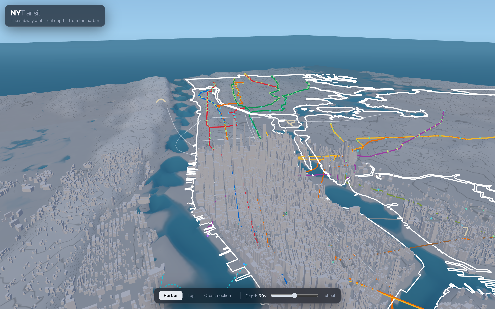

# NYTransit

An interactive **3D map of New York City transit** — the subway shown at its
real depth below the streets, the PATH tubes crossing under the Hudson to New
Jersey, surface buses on the ground, and the Manhattan skyline above — all
viewed from the harbor, from the vantage of the Statue of Liberty.

On load, the network **grows the way it was actually built**: the 1904 IRT lines
appear first, then the BMT, then the IND, over about ten seconds.



## What you're looking at

- **Terrain** — real elevation (DEM) rendered as a **grayscale stepped-contour
  relief** so the colored lines pop. NYC's hills matter: Washington Heights sits
  on a ridge ~60 m up, which is why 191 St is ~173 ft below the street yet still
  *above* sea level. Bright sky above the waterline, deep blue below.
- **Subway lines** — real MTA route geometry and official colors, draped at each
  station's real structure depth and diving into the under-river tubes.
- **PATH** — the trans-Hudson tubes to Jersey City, Hoboken and Newark
  (dashed cyan), descending ~97 ft below sea level mid-river.
- **Bridges & the Roosevelt Island Tram** — the East River, Harlem River and
  Hudson crossings shown as elevated arches above the water.
- **Solid earth + bathymetry** — the terrain is a translucent earth volume with
  river banks and beds, so you can watch the tunnels bore through the ground and
  under the riverbeds.
- **Stations** — colored by their elevation vs. sea level. Hover (or tap) for
  lines, structure, depth below street, and elevation.
- **Buildings** — real footprints with **real roof heights**: the tallest
  ~14,000 in the Manhattan core (NYC Open Data) plus the **Jersey City / Hoboken
  skyline** (OpenStreetMap), so both banks of the Hudson are accurate.
- **Depth exaggeration** — a slider (default 50×) applied to *depths* so the
  underground story reads at a glance; terrain and buildings stay believable.

## Run locally

```bash
npm install
npm run dev
```

## Build for production

```bash
npm run build      # -> dist/  (static, self-contained)
npm run preview
```

Deploys to **Vercel** as a static site with no backend — all data is pre-baked
into `public/data/*.json`, so there are no runtime network calls or secrets.
`vercel.json` sets a strict Content-Security-Policy and hardening headers.

## Regenerating the data (optional)

The committed `public/data/*.json` is all the app needs. To rebuild it from
source (requires network):

```bash
npm run data       # or run individually:
node scripts/build-terrain.mjs     # DEM elevation tiles         -> terrain.json
node scripts/build-buildings.mjs   # NYC + NJ building footprints -> buildings.json
node scripts/build-bridges.mjs     # OSM bridge & tram geometry   -> crossings.json
node scripts/build-data.mjs        # MTA + GTFS + PATH            -> transit.json
```

## Data sources

- MTA Subway Stations (data.ny.gov) — structure type, coordinates, routes
- MTA GTFS static feed — line shapes and official colors
- Terrarium DEM elevation tiles (AWS `elevation-tiles-prod`)
- NYC Open Data Building Footprints (`5zhs-2jue`) — footprints + roof heights
- OpenStreetMap (via Overpass) — New Jersey buildings, bridge & tram geometry
- Depths — Wikipedia (deep stations & river tunnels) + a cut-and-cover heuristic

Depths, ground elevations and building heights are **approximate** — this is a
visualization, not an engineering reference.
